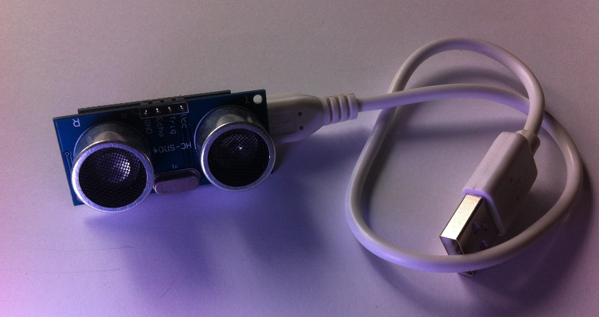
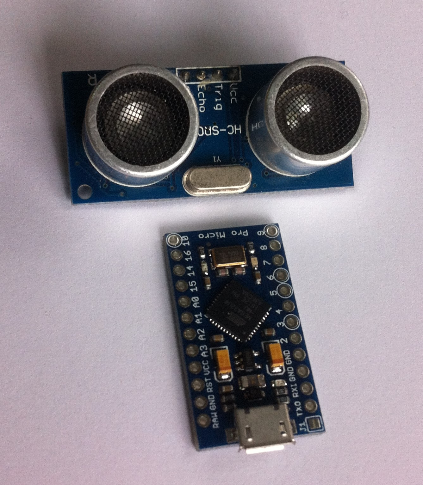
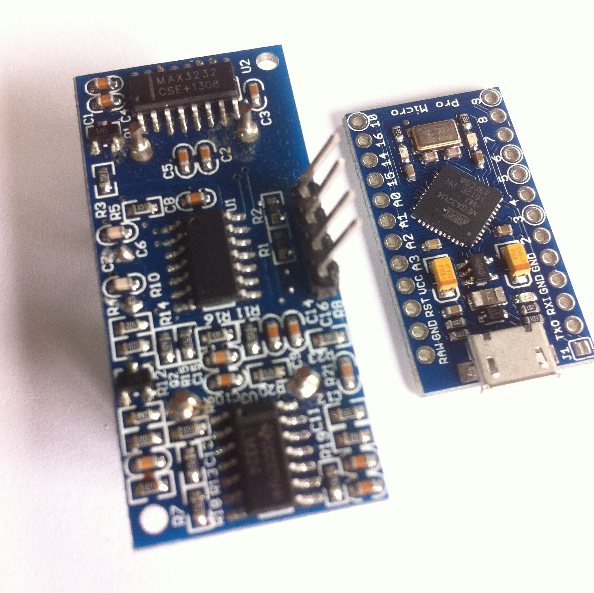
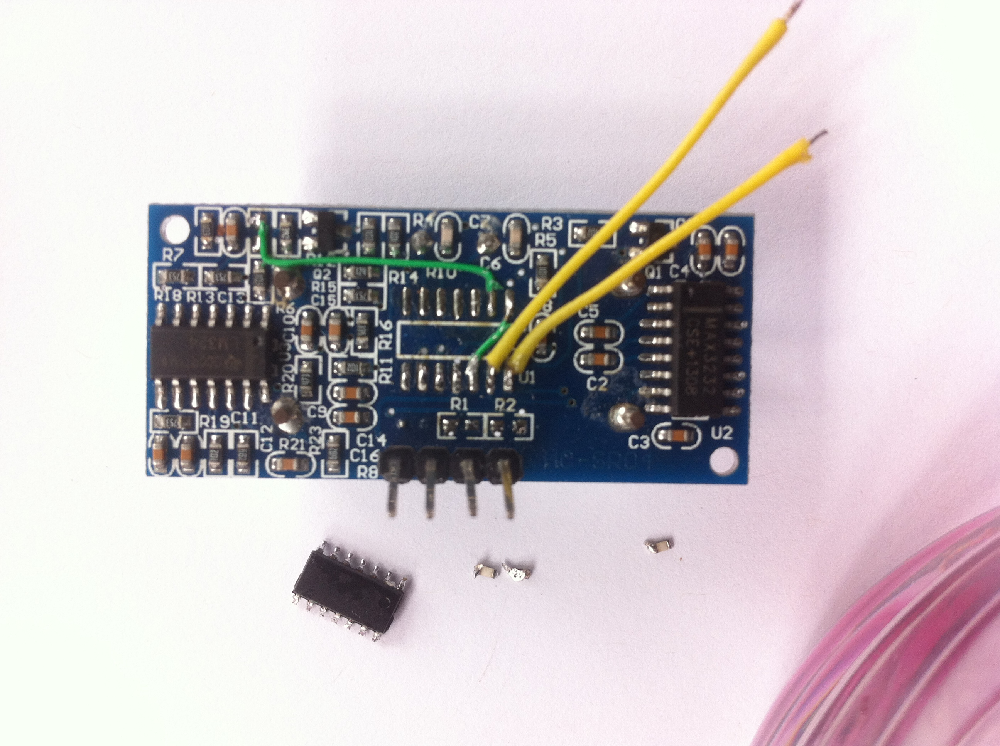
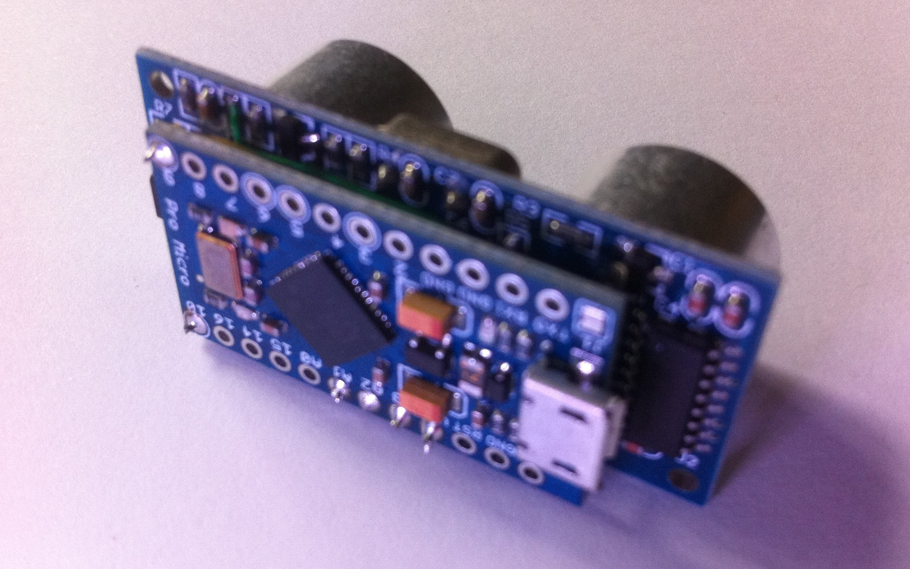

# PulseEcho
Code and details to modify a HC-SR04 Ultrasonic 'time of flight' distance sensor to a 'signal over time' sonar sensor.

This is an overview of how to modify a common HC-SR04 Ultrasonic Sensor into a more capable "Sonar" module that will record an analog signal over time, rather than a digital time count to 'first reflection'. This allows multiple 'targets' to be detected, rather than just the closest.

Note that there are many variants of the HC-SR04 module, and the example images and schematic are for _different versions_. Specifically the component identification nummbers and the microcontroller pins do not match. This is therefore best read as a rough guide than an exact modification plan.

The basic idea is to replace the on-board microcontroller and use the arduino to take full control over the analog sections of the module. This is done by removing components and 'hotwiring' parts of the module directly to pins on the arduino. Instead of two digital signals; one input and one output (Trigger and Echo) the Arduino will need to control three digital outputs (TX Enable, TX1, TX2) and one analog input (Echo)

## Parts
You will need a HC-SR04 module and a 5V compatible Arduino based on the ATmega32U4, such as the Leonardo or the Micro. I used a SparkFun 'Pro Micro' due to its small form factor that could be directly mounted on the back of the ultrasonic sensor module. 

Note that ATmega328P Arduinos like the UNO, or ARM-based boards will **NOT** work with the example code (which uses Timer4 on the 32U4 to generate the 40Hkz transmit signal in hardware), but there's no reason they can't work in theory; you'll just have to figure out a different way to generate the signal with sufficient accuracy. (note that using delay() calls is unlikely to get the precision needed)

## Modifying the HC-SR04

The schematic for the modified module is shown below. The existing connector is used for power (+5V and GND) as normal. The 'Echo' pin is repurposed as the analog signal input, the 'Trigger' pin is used as the power enable for the MAX232, and two extra wires are added to drive the ultrasonic transmitter 'speaker'. 

The following modifications are made:
* The microcontroller chip is removed.
* The pullup resistors on the connector pins are removed. This is mostly to avoid affecting the analog 'Echo' signal.
* The 'HVOff' signal is routed to the 'Trigger' pin on the connector by adding a jumper across two of the microcontroller pads.
* Two long wires are soldered to the 'TX1' and 'TX2' microcontroller pads.
* The resistor that connects the '40Khz filter' stage to the 'Schmitt Trigger' stage of the analog reciever is removed, and the signal is re-routed to the 'Echo' pin by wiring it to the connected pad of the microcontroller.

## Arduino Wiring
The example code uses the following Arduino pin assignments:

Pin 9:  TX1
Pin 10: TX2
Pin A3: Trigger/HVOff
Pin A2: Echo

Note that pins 9 & 10 are dedicated to the Timer4 hardware module used to generate the transmit signal, and can not be reassigned without major changes to the code. 

On my prototype, Pin A1 was shorted to GND so that the modules could be soldered directly together but this detail is not visible in the photos. If you do this, be careful not to drive A1 to logic high or you might burn out the 32U4 or that pin.

## Theory of Operation

In order to send an ultrasonic pulse, the 'speaker' transducer needs to have a voltage applied across it at about 40Khz. Only about a dozen cycles need to be applied, this will 'ring' the speaker element like a bell, and cause a short highly-directional ultrasonic pulse to come out the front.

Because this 'speaker' is a piezoelectric element, it requires a fairly large voltage (at least 20 Volts) and a modest inrush of current because it acts like a capacitor. The MAX232 chip is intended for driving RS232 serial lines at +/-12 volts. It has an internal charge pump that allows the chip to generate these higher voltages from a standard 5V supply. The chip has two drivers, so if we connect one to each side of the speaker we can create a 24V differential across the piezo in either direction. By rapidly flipping the logic inputs to the driver chip, we can create an AC signal that is 48V peak-to-peak across the element! It's quite an effective and clever use of the chip.

Because the MAX232's internal charge pump generates a lot of electrical noise on the voltage rails, it is useful to be able to power down the entire chip after the pulse is sent so we get a 'quiet time' during which the echo signal can be recieved with the best signal-to-noise ratio. The 'HVOff' signal controls a power transistor so that a logic low will power up the MAX232, and a logic high will power it down.

Therefore to send an ultrasonic pulse the correct series of operations is:
* Initialize with TX1 and TX2 to the same logic level (low or high) and 'HVOff' set high.
* Set 'HVOff' low.
* Wait for the charge pump to stabilize. (About 5 millisconds)
* Set TX1 and TX2 to opposite logic levels to create a voltage across the piezo.
* Send a sequence of around 12 voltage pulses to the piezo by alternating TX1 and TX2 at 80Khz
* Return TX1 and TX2 to the same logic level.
* Set 'HVOff' high.

The ultrasonic reciever 'microphone' is a similar piezo element that develops an AC voltage (though nowhere near as much) when it hears an ultrasonic signal. The LM324 is a quad op-amp, and is used to construct four discrete sub-blocks:
* pre-amplifier.
* 40Hkz filter.
* signal buffer/level shifter
* 'Schmitt Trigger' with settable threshold

The purpose of the final two stages is to condition the analog echo signal into a digital signal that is used to time the echo pulse by the relatively simple microcontroller on the module. Because we want to record an analog signal over time, we want to bypass these final two stages and feed the output of the 40Khz filter directly to an ADC input on the Arduino.

It might be possible to avoid having to remove the microcontroller on the module (and having to generate the trasmit pulses ourselves) by simply tapping this one signal. However we would lose some control over the course of events; for example our ADC readings could be affected by the 'threshold' signal in unknown ways, and the module's microcontroller imposes timing limitations we want to ignore.

## Arduino Code
The example code has a ping() routine which performs the above operations to transmit an ultrasonic pulse, and a sample() routine which fills an array with analog readings taken over a short period of time after the pulse is sent.

The ping() routine uses the Timer4 hardware 

Once the buffer array is filled, you can do whatever you wish with the readings. The example code displays graphs on an OLED module, but you can uncomment the Serial.print() lines to debug to the serial console.

Within the ping() routine is a call to timer_start(). The example code uses the parameters (612,12). That means to send 12 pulses with a frequency of 612 timer 'ticks'. This was experimentally determined to create the loudest and cleanest transmit/return pulse on my hardware. You may wish to experiment with these numbers by changing them _very_ slightly.

## OLED Display
You can optionally add an SSD1331 color OLED display by connecting it to the Arduino's SPI pins. (or any pins really, but hardware SPI is faster and better) 

By default you will see a display that has an expanding 'ping' circle overlaid on a symmetric dot graph drawn by sonar_graph(). This is tuned to run fast and look cool.

You can also show a more standard oscilloscope-like bar-graph of the contents of the signal buffer by calling range_graph(). 
